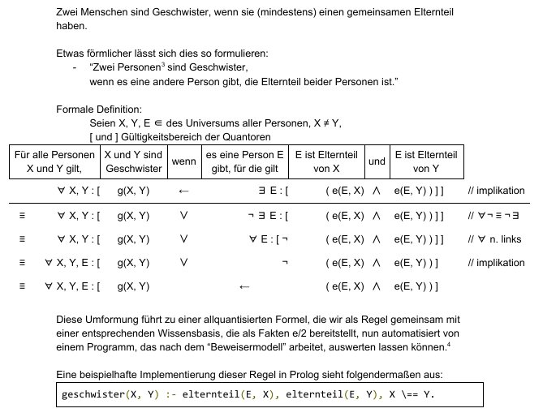

# haw-lb-a3

Vorlesung "Logik und Berechenbarkeit"  
Übung "Familiendatenbank in Prolog"  
Bei Prof. Dr. Klauck  
Benotet mit 13 Punkten  

**Gegeben ist eine Familiendatenbank, die verschiedene Personen beschreibt.**
(`src/familie.pl`)
- elternteil/2 (Person1 ist Elternteil von Person1)
- verheiratet/2 (Person1 ist mit Person2 verheiratet)
- maennlich/1
- weiblich/1

**Implementiert wurden:**
(`src/teil1.pl`)
- Prädikate (Funktionen), die Aussagen über das Verwandtschaftsverhältnis
  von Personen aus der Datenbank treffen
    - vorfahre & nachkomme
    - geschwister
    - bruder & schwester
    - eheleute
    - uroma & uropa
    - oma & opa
    - mutter & vater 
- Prädikate zur Konsistenzprüfung der Datenbank

**Getestet werden die Implementationen mit gegebenen Testfällen.**
(`src/test.pl`)

# Schriftliche Ausarbeitung
[Deduktive Datenbanken und Unifikation - Teil 1 Familien-Datenbank.pdf](Deduktive_Datenbanken_und_Unifikation_-_Teil_1_Familien-Datenbank.pdf)
(14 Seiten)

# Beispiel
Der Weg einer Fragestellung
von natürlicher Sprache
über die mathematische Definition
zu einer Prolog-Anfrage
anhand des Beispiels
des Verwandtschaftsverhältnisses
`geschwister(X, Y)`.

# Zugriff auf Prolog-Ergebnisse mit Python

(nachträgliche Ergänzung ab 2021)

Siehe `prolog.py`